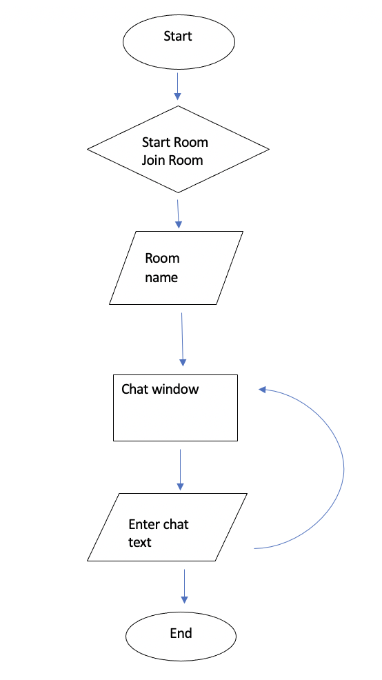

# RAM chat 

RAM chat is a web-based chat application for the user looking for simplicity and privacy. With no login or sign up required, users create a room name on the fly, allowing others to join in the room. User privacy is always maintained, as no data is kept on the server. The name, RAM chat, personifies the temporary nature of data associated with the chat. The conversation takes place, in the RAM of the user’s device. 

### RAM chat link

RAM chat can be found here: https://ram-chat-by-invite.herokuapp.com/

## Features

With an intuitive interface, navigating the app is easy. The user is first prompted to create a room or join a room.

Upon completing either choice, the user is faced with the chat window, which will alert of any activity, including users joining or leaving, name changes and the conversation.

The hamburger menu will reveal more information and options. The cunning user, can monitor the number of live participants, reassuring privacy. A new alias can also be configured.

## Development

Node.js back-end and React front-end

The project was a task in full stack web development. Practicing skills learned over the 12 week General Assembly, Software Engineering Immersive. The webserver was built using Express and included socket.io to handle communication between server and clients.

React was used to build the client side. 

The concept for RAM chat, stems from a desire to learn multiplayer/multiclient communication. Socket.io was outside the scope of the course and was great to pick a new technology.

### Code Overview

The server has an array of room objects. When a room is created by the user, and room object is pushed onto the room array. 

The room object is composed of room name and an array of client objects. 

Each client has a socket object (created by socket.io), and an alias (name used by the client in the chat).

The socket object has information that is used by socket.io when routing messages and communicating to clients. The socket object also has an id, that is used to authenticate the client to a room.

## Difficulties and Challenges 

A lack of clarity about how socket.io was going to work, made it difficult to plan the project. It was not clear what features were going to be needed for communication between clients or to guarantee authenticity. Early experiments to learn the technology, ended up being included in the final product

As a first study on the topic, future projects will vastly be improved utilising socket.io’s library and concepts. It was a challenge to learn the socket.io methodology in time for the projects. As a result, socket.io was not utilised to its potential.

The React front end did not completely utilise the React methodology. Components were used minimally. If time permits after the course, the code will be refactored to use components more.

## Reflection

Planning was lacking for this project, which would have made the code clearer and more concise to follow. The hope was to have enough time to refactor the code into a more modular structure. It is important to have good structure from the start of a project as time will always be lacking for refactoring. Good structure would also make the code more scalable in the future.

All up, this was a great coding exercise to reaffirm what has been learned over the 12 week course.  
